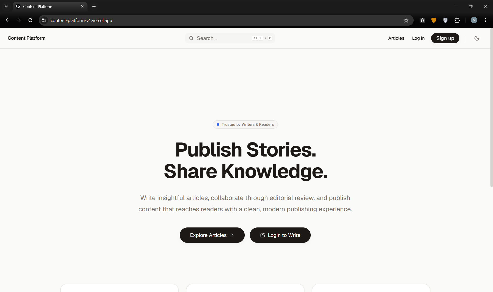
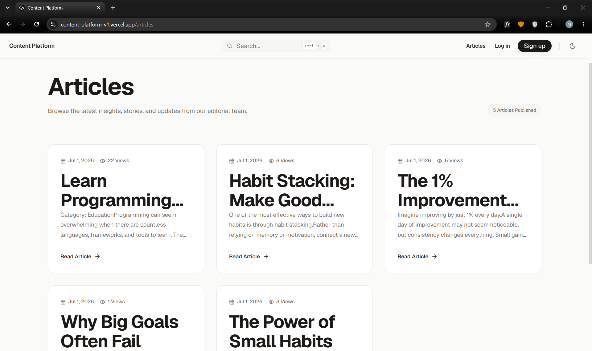
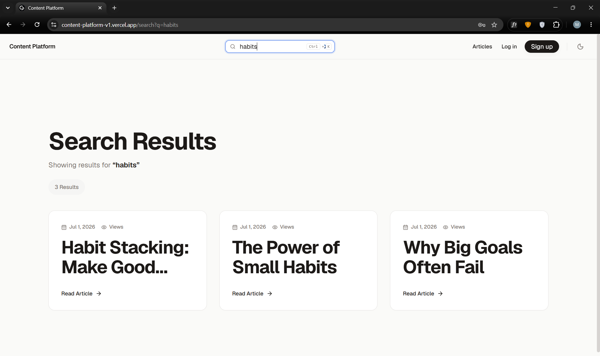
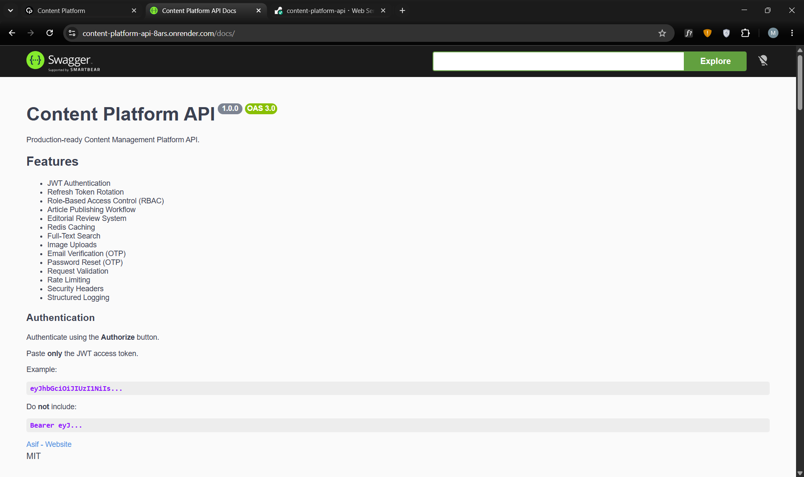

# Content Platform


A production-oriented content publishing platform built with Next.js, Express.js, MongoDB, and Redis.

The platform provides secure authentication, role-based access control, article publishing workflows, Redis-powered caching, full-text search, background job processing, SEO optimization, and production-ready architecture.

---


[Live Demo](https://your-domain.com)

Frontend:
https://your-frontend-domain.com

Backend API:
https://your-backend-domain.com

Swagger Docs:
https://your-backend-domain.com/docs

Repository:
https://github.com/asif-codeverse/content-platform

---

## Screenshots

### Home Page



### Articles Listing



### Search Results



### Admin Dashboard


### Swagger API Documentation



---


## Features

### Authentication & Authorization

* JWT Access Tokens
* Refresh Token Rotation
* HttpOnly Refresh Cookies
* Role-Based Access Control (RBAC)
* Attribute-Based Access Control (ABAC)
* Secure Password Hashing with bcrypt

### Content Management

* Create Articles
* Edit Articles
* Publish Articles
* Soft Delete Articles
* Slug-Based Routing
* Draft & Published States

### Search

* MongoDB Full-Text Search
* Search Pagination
* Redis Search Caching

### Performance

* Redis Cache Layer
* Article List Caching
* Individual Article Caching
* Search Result Caching
* HTTP Cache Validation
* 304 Not Modified Support

### Background Processing

* Job Queue System
* Worker Processing
* Retry Support
* Article Publication Jobs

### Security

* JWT Authentication
* Refresh Token Rotation
* RBAC + ABAC Authorization
* Helmet Security Headers
* Rate Limiting
* Input Validation
* Secure Cookie Handling

### SEO

* Dynamic Metadata Generation
* Sitemap Generation
* robots.txt Generation
* SEO-Friendly URLs
* Dynamic Article Metadata

### Observability

* Structured Logging
* Request Correlation IDs
* Audit Logs
* Error Tracking

### Testing

* Integration Testing
* Authentication Testing
* RBAC Testing
* Publishing Workflow Testing
* Ownership Validation Testing

---

# Tech Stack

## Frontend

* Next.js 16
* React
* TypeScript
* Tailwind CSS
* App Router

## Backend

* Express.js
* Node.js
* MongoDB
* Mongoose
* Redis

## Infrastructure

* MongoDB Atlas
* Redis
* GitHub Actions

## Testing

* Jest
* Supertest

---

# Architecture

```text
Browser
   │
   ▼
Next.js Frontend
   │
   ▼
Express REST API
   │
 ┌─┴─────────────┐
 ▼               ▼
MongoDB        Redis
Atlas          Cache
   │
   ▼
Background Jobs
```

---

# Repository Structure

```text
content-platform/
│
├── client/
│   ├── app/
│   ├── components/
│   ├── context/
│   ├── services/
│   └── middleware/
│
├── server/
│   ├── src/
│   │   ├── modules/
│   │   ├── middlewares/
│   │   ├── jobs/
│   │   ├── config/
│   │   ├── utils/
│   │   └── docs/
│   │
│   └── __tests__/
│
└── docs/
```

---

# Authentication Flow

```text
Login
   │
   ▼
Access Token Issued
   │
   ▼
Protected API Access
   │
   ▼
Access Token Expires
   │
   ▼
Refresh Endpoint
   │
   ▼
New Access Token
```

---

# Authorization Model

## Roles

### USER

* Read published articles

### EDITOR

* Create articles
* Edit own articles

### ADMIN

* Full platform access
* Publish articles
* Delete articles
* Manage content

---

# API Documentation

Swagger UI:

```text
http://localhost:5001/docs
```

Major API Groups:

```text
Auth
Articles
Search
Health
```

---

# Installation

## Clone Repository

```bash
git clone <repository-url>
cd content-platform
```

## Install Dependencies

Root:

```bash
npm install
```

Client:

```bash
cd client
npm install
```

Server:

```bash
cd server
npm install
```

---

# Environment Variables

## Server

Create:

```env
PORT=5001

NODE_ENV=development

MONGODB_URI=

JWT_ACCESS_SECRET=
JWT_REFRESH_SECRET=

REDIS_HOST=
REDIS_PORT=
```

## Client

Create:

```env
NEXT_PUBLIC_API_URL=http://localhost:5001/api/v1
```

---

# Running Locally

## Development

```bash
npm run dev
```

Starts:

```text
Client : localhost:3000
Server : localhost:5001
```

## Production Build

Frontend

```bash
cd client

npm run build
npm run start
```

Backend

```bash
cd server

npm start
```

---

# Search

Example:

```http
GET /api/v1/search?q=redis
```

Supports:

* Full-text search
* Pagination
* Redis caching

---

# Caching Strategy

## Article List

```text
articles:published:page:{page}:limit:{limit}
```

## Single Article

```text
article:{slug}
```

## Search

```text
search:{query}:page:{page}:limit:{limit}
```

Cache invalidation occurs automatically when content changes.

---

# Testing

Run:

```bash
npm test
```

Coverage includes:

* Authentication
* Authorization
* Publishing Workflow
* Search
* Ownership Rules

---

# Health Check

```http
GET /api/v1/health
```

Returns:

```json
{
  "status": "ok",
  "mongodb": "connected",
  "redis": "connected"
}
```

---

# CI/CD

GitHub Actions automatically verifies:

```text
Dependency Installation
Automated Tests
Build Validation
```

Triggered on:

```text
Push
Pull Request
```

---

# Future Roadmap

* Google OAuth
* Email Verification
* Image Upload Support
* Cloud Storage Integration
* Content Moderation
* AI-Assisted Search
* Analytics Dashboard
* Admin User Management

---

# Production Principles

The project is designed around:

* Security First
* Explicit Trust Boundaries
* Stateless Authentication
* Cache-Aware Design
* Reliability Under Failure
* Clear Separation of Concerns
* Scalable Architecture
* Production-Oriented Engineering

---

# License

MIT License
