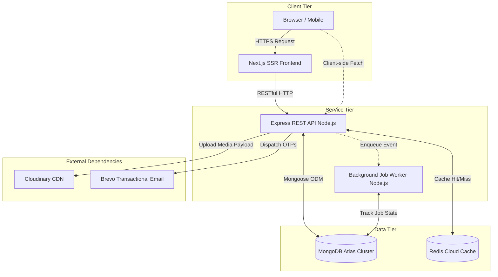
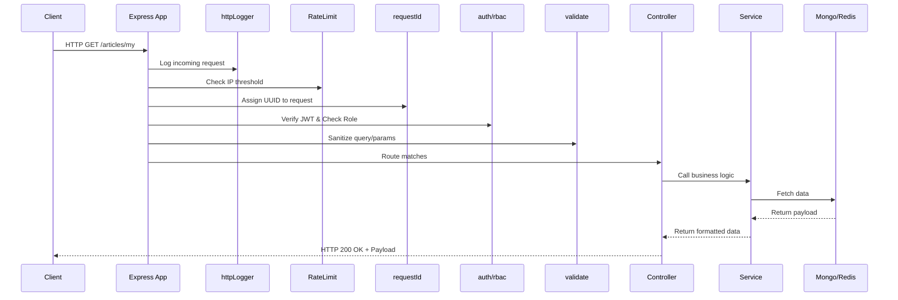
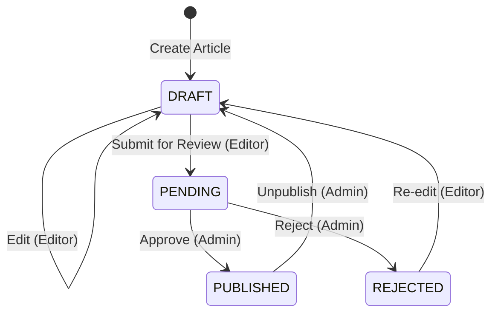
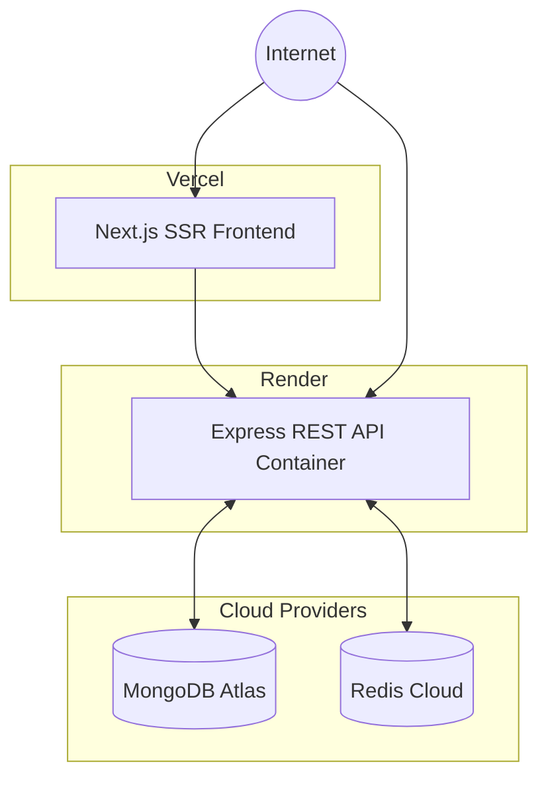

# Architectural Documentation

## 1. Overview

The Content Platform is a production-grade, headless content management system (CMS) tailored specifically for complex editorial workflows. Built on a modernized Node.js and React stack, it provides a highly decoupled, stateless architecture designed to support digital publishers. 

The primary business problem this system solves is the friction between editorial authoring and robust technical delivery. By completely decoupling the presentation layer (Next.js) from the business logic and persistence layer (Express.js, MongoDB), the platform allows editorial teams to draft, review, and publish rich media content while engineering teams can scale the distribution of that content horizontally. 

This document serves as the comprehensive engineering blueprint for the platform. It outlines the architectural decisions, structural topologies, and technical trade-offs that dictate how the system operates in a production environment. 

---

## 2. Design Goals

The architecture of the Content Platform is driven by several strict engineering goals:

1. **Read-Heavy Performance Over Optimization for Writes**: Content platforms typically exhibit a 99:1 read-to-write ratio. The system aggressively prioritizes read performance through multi-tier caching (Redis) and client-side caching (ETags) over write speed.
2. **Horizontal Scalability via Statelessness**: The backend retains absolutely no session state. Authentication relies on cryptographically signed JSON Web Tokens (JWTs), ensuring that API requests can be routed to any healthy Express pod in a round-robin fashion without requiring sticky sessions.
3. **Explicit Trust Boundaries**: Client payloads are intrinsically distrusted. The system operates on a "verify, then trust" model, utilizing strict schema validations (Zod) at the absolute edge of the request lifecycle.
4. **Resilience Under Load**: Non-critical operations (like dispatching transactional emails or incrementing article view counters) must never block the main Node.js event loop. Background task processing is utilized extensively to maintain consistent response times.
5. **Developer Experience (DX)**: The codebase must remain highly approachable. Complex, over-engineered paradigms (like microservices for a small domain or heavy message brokers like Kafka) are actively avoided in favor of a clean, layered monolithic approach.

---

## 3. Architectural Principles

### Defense in Depth
Security is not treated as a peripheral feature but is baked into the middleware pipeline. The system employs IP-based rate limiting to thwart brute-force attacks, Helmet.js for secure HTTP header injection, and HTTP-Only cookies to protect refresh tokens from cross-site scripting (XSS) exfiltration. 

### Separation of Concerns (Layered Architecture)
The backend enforces strict separation between routing, validation, business logic, and data access. Controllers are entirely devoid of database queries, and services remain agnostic to HTTP requests or responses. This allows core business logic to be invoked by either an HTTP controller or an asynchronous background worker interchangeably.

### Fail Fast
When invalid payloads, unauthorized access attempts, or malformed queries hit the backend, the system immediately returns standardized, deterministic error responses. Errors are caught centrally by a custom error-handling middleware, logged via Winston with associated request correlation IDs, and safely presented to the client.

---

## 4. Repository Structure

The platform is housed in a monorepo, delineating the client and server application scopes while allowing full-stack developers to easily trace features across the network boundary.

```text
content-platform/
├── client/                     # Next.js 16 Presentation Layer
│   ├── app/                    # Next.js App Router (Server & Client Components)
│   ├── components/             # Reusable UI primitives and complex widgets
│   ├── context/                # React Contexts (e.g., Theme, Auth state)
│   ├── hooks/                  # Custom React hooks for localized logic
│   ├── lib/                    # Shared utilities and formatters
│   ├── services/               # Axios instances and API wrapper functions
│   └── types/                  # Global TypeScript interfaces
│
├── server/                     # Express.js Application Boundary
│   ├── src/
│   │   ├── config/             # Environment schemas and database connectors
│   │   ├── docs/               # Swagger UI initialization and schemas
│   │   ├── jobs/               # Asynchronous workers and queue management
│   │   ├── middlewares/        # Express request interceptors
│   │   ├── modules/            # Domain-driven feature clusters
│   │   │   ├── articles/       # Editorial models, services, and routes
│   │   │   ├── auth/           # Identity lifecycle management
│   │   │   ├── search/         # Discovery and text indexing logic
│   │   │   ├── upload/         # Cloudinary media ingestion
│   │   │   └── users/          # Administration and role assignment
│   │   ├── services/           # Agnostic external integrations (Email, Cache)
│   │   └── utils/              # Helper utilities (Logger, Parsers)
│   ├── __tests__/              # Jest integration testing suites
│   └── test-utils/             # MongoDB Memory Server initialization
│
├── docs/                       # High-level technical documentation
└── .github/workflows/          # GitHub Actions for CI/CD and Docker builds
```

### Why this structure?
By organizing the backend by `modules` (Domain-Driven Design) rather than standard MVC buckets (all controllers in one folder, all models in another), the codebase scales significantly better. A developer working on `articles` finds the routes, controller, service, validation schema, and Mongoose model all in a single, cohesive directory.

---

## 5. High-Level Architecture

The system operates across three distinct tiers: the Client Tier, the Service Tier, and the Data Tier. 



1. **Client Tier**: Handles presentation, user input collection, and client-side routing. Next.js handles initial page loads via Server-Side Rendering (SSR) for SEO optimization, followed by client-side hydration for dynamic interactivity.
2. **Service Tier**: The Express.js backend acts as the authoritative source of truth. It processes all business rules, validates incoming data, and orchestrates database transactions.
3. **Data Tier**: MongoDB stores persistent document data, while Redis provides an ephemeral, high-speed memory layer for cached responses.
4. **External Dependencies**: Offloads specialized tasks. Cloudinary handles global image delivery and resizing, while Brevo guarantees transactional email delivery.

---

## 6. Request Lifecycle

Every HTTP request entering the backend traverses a highly deterministic, heavily audited middleware pipeline. Understanding this lifecycle is critical for debugging and scaling.



### The Middleware Pipeline

| Middleware | Responsibility |
|---|---|
| `httpLogger` | Intercepts requests to log the HTTP method, path, and user-agent. Ensures observability. |
| `rateLimit` | Protects the system from brute-force and DDoS attacks by capping requests per IP window. |
| `requestId` | Injects a unique UUID into `req.requestId`. Used to trace requests across complex async flows and external service calls. |
| `authenticate` | Extracts the Bearer token, verifies the cryptographic signature, and attaches the decoded user payload to `req.user`. |
| `authorize` | Checks if `req.user.role` exists within the allowed roles array for the specific route endpoint. |
| `validate` | Parses `req.body`, `req.query`, and `req.params` against strict Zod schemas. Strips unknown fields. |

---

## 7. Backend Architecture

The backend is built on **Express.js** and **Node.js**. Rather than relying heavily on class-based OOP patterns, the codebase leverages functional programming paradigms, heavily utilizing modern ES modules.

### The `asyncHandler` Wrapper
Node.js natively crashes if a promise rejection is unhandled. To prevent writing repetitive `try/catch` blocks in every controller, the platform wraps controllers in an `asyncHandler`. 

```javascript
// utils/asyncHandler.js
export const asyncHandler = (fn) => (req, res, next) => {
    Promise.resolve(fn(req, res, next)).catch(next);
};
```
This forces all promise rejections to be automatically forwarded to the global `error.middleware.js`, guaranteeing that the client receives a standardized JSON error response rather than a hung connection.

### Global Error Handling
The `error.middleware.js` acts as the final safety net. It intercepts all errors, determines if they are operational (e.g., 400 Bad Request, 404 Not Found) or programmatic (e.g., 500 Internal Server Error), logs the stack trace securely (without leaking it to the client in production), and returns a predictable object containing a `success: false` flag and the `requestId`.

---

## 8. Frontend Architecture

The frontend is a modern **Next.js 16** application utilizing the **App Router** architecture. 

### Why Next.js?
Content platforms demand strong SEO. Standard React Single Page Applications (SPAs) ship empty HTML files to the browser, relying on JavaScript to render content. This is heavily penalized by search engine crawlers. Next.js solves this by securely fetching data on the server and rendering complete HTML before responding to the browser.

### Key Frontend Paradigms
- **Server Components vs Client Components**: The application strictly separates components. Layouts, SEO metadata, and standard views are rendered entirely on the server. Interactive elements (like the TipTap Rich Text Editor, or React Hook Form logic) are marked with `"use client"` to hydrate in the browser.
- **State Management**: Complex global state managers (like Redux) are avoided. Server state is managed via Axios interceptors and Next.js fetch caching. Local UI state is handled natively with React `useState` and `useContext`.
- **Styling**: Tailwind CSS v4 provides a utility-first styling approach, eliminating complex CSS-in-JS runtimes and preventing CSS specificity wars.

---

## 9. Authentication

Authentication operates on a stateless, two-token system: **Short-Lived Access Tokens** and **Long-Lived Refresh Tokens**.

### Why Not Sessions?
Traditional session-based authentication requires the server to query a database (or Redis) on every single request to validate the user's session ID. This creates a massive bottleneck. JWTs carry the user's identity cryptographically signed within the payload, allowing the server to mathematically verify the user's identity entirely in memory.

### The Token Lifecycle

| Token | Purpose | Storage | Lifetime |
|---|---|---|---|
| **Access Token** | Used for accessing protected API endpoints via the `Authorization: Bearer` header. | In-memory (React State / Closure) | 15 Minutes |
| **Refresh Token** | Used exclusively to request a new Access Token when the old one expires. | HTTP-Only, Secure Cookie | 7 Days |

### Refresh Token Rotation
A common vulnerability with long-lived refresh tokens is extraction via physical device compromise or advanced XSS. The Content Platform mitigates this via **Refresh Token Rotation**.

1. When a user logs in, the server generates a refresh token containing a `version` number matching the user's `refreshTokenVersion` in MongoDB.
2. The server issues this token as an HTTP-Only cookie, rendering it completely invisible to client-side JavaScript.
3. When the access token expires, the client sends the refresh token to the `/refresh` endpoint.
4. The server validates the token, checks the version against the database, **increments the version in the database**, and issues an entirely new refresh token and access token.

If a malicious actor steals a refresh token and uses it, the version is incremented. When the legitimate user later attempts to use their (now outdated) refresh token, the server detects the version mismatch, realizes a token theft has occurred, and immediately forces a re-authentication by invalidating all tokens.

---

## 10. Authorization (RBAC + ABAC)

Authentication answers "Who are you?". Authorization answers "What are you allowed to do?".

The platform utilizes a hybrid approach: **Role-Based Access Control (RBAC)** layered with **Attribute-Based Access Control (ABAC)**.

### Role Definitions

| Role | Permissions |
|---|---|
| `USER` | Can read published articles. Can manage their own profile and authentication settings. |
| `EDITOR` | Inherits `USER` permissions. Can create draft articles, edit their own articles, and submit them for review. |
| `ADMIN` | Inherits all permissions. Can review, publish, or reject pending articles. Can delete any content globally. Can assign roles to other users. |

### Why ABAC?
RBAC alone is insufficient for a content platform. While an `EDITOR` has the role-based permission to edit an article, they should only be permitted to edit *their own* articles. 

ABAC is enforced directly at the service and controller layer. When an `EDITOR` attempts to update an article, the system checks:
```javascript
if (req.user.role !== "ADMIN" && article.author.toString() !== req.user.id) {
    throw new ForbiddenError("You do not have permission to modify this resource");
}
```
This ensures that horizontal privilege escalation (accessing another user's data of the same tier) is impossible.

---

## 11. Articles Domain

The `Articles` module represents the core domain of the platform. It handles the entire lifecycle of editorial content.

### State Machine Workflow
An article does not simply exist; it transitions through a heavily guarded state machine enforced by the Mongoose model.



### Soft Deletion
Articles are never physically removed from the MongoDB cluster upon deletion. Instead, the `isDeleted` boolean is set to `true`.

**Why Soft Delete?**
1. **Auditability**: Prevents destructive loss of historical data.
2. **Referential Integrity**: If an article is physically deleted, any internal analytics, user reading histories, or external foreign keys pointing to that `_id` will break. 
3. **Recovery**: Allows administrators to easily restore accidentally deleted content.

### View Counter Logic
Tracking article views synchronously during the `GET /:slug` request is an anti-pattern. Writing to the database on every read request destroys the benefits of read caching. 
Instead, the platform fires a fire-and-forget event to the background job queue (`ARTICLE_VIEWED`). The worker processes the queue and safely increments the `$inc: { views: 1 }` operation asynchronously, ensuring the reader experiences zero latency.

---

## 12. Search Architecture

Content discovery is paramount. The platform implements a high-performance search capability natively using MongoDB, avoiding the heavy infrastructural overhead of maintaining a separate Elasticsearch cluster.

### Implementation Details
The `Article` Mongoose schema defines a compound text index:
```javascript
articleSchema.index({
  title: "text",
  content: "text",
});
```
When a client hits the `GET /search?q={query}` endpoint, the query is passed to the MongoDB `$text` operator. MongoDB calculates text scores based on keyword density and relevance, returning the most accurate documents first.

### Why not Elasticsearch?
Elasticsearch is incredibly powerful but requires significant operational overhead, complex data synchronization pipelines (logstash/kibana), and high memory consumption. For a standard editorial platform, MongoDB's native B-Tree text indexing provides more than enough performance with zero added architectural complexity.

---

## 13. Database Design

The data persistence layer utilizes MongoDB Atlas. The database is designed favoring **denormalization and references** depending on the volatility of the data.

### Collections

| Collection | Purpose | Design Philosophy |
|---|---|---|
| `users` | Stores identity, credentials, and OTP states. | Highly indexed by `email`. Structured to maintain token versioning for security. |
| `articles` | Stores core content, SEO slugs, and view metrics. | Contains a reference to `users` via `author` ObjectId. Heavily indexed by `slug` and `status` to ensure fast resolution of public reads. |
| `jobexecutions` | Tracks background job states (`jobId`). | Ephemeral execution logs. Prevents horizontal scaling edge-cases where multiple pods attempt to process the exact same background event. |

### Indexing Strategy
Indexes drastically improve read performance at the cost of slight write degradation. The `articles` collection features a critical compound index:
`{ status: 1, isDeleted: 1, createdAt: -1 }`
This index perfectly maps to the query utilized by the public feed (`GET /`), allowing MongoDB to execute an index-covered scan to return recent published articles instantaneously.

---

## 14. Redis Caching

Database disk I/O is the slowest component of any web architecture. The Content Platform mitigates this by intercepting read-heavy requests and serving them directly from Redis RAM.

### Cache Keys

| Key Pattern | Description | Time-To-Live (TTL) |
|---|---|---|
| `articles:published:page:{page}:limit:{limit}` | Paginated list of public articles. | 5 Minutes (300s) |
| `article:{slug}` | Individual article payload resolution. | 5 Minutes (300s) |
| `search:{query}:page:{page}:limit:{limit}` | Full-text search result sets. | 5 Minutes (300s) |

### Surgical Cache Invalidation
Caching is notoriously difficult due to invalidation. If an editor corrects a typo in an article, readers must see the correction immediately. 
The system does not rely on arbitrary TTL expirations. When an article is successfully transitioned to `PUBLISHED`, or an already published article is `UPDATED`, the service layer forcefully intercepts Redis and deletes the specific `article:{slug}` key, as well as executing a wildcard deletion of all `articles:published:*` list keys. This guarantees immediate eventual consistency.

---

## 15. Background Jobs

Traditional HTTP requests are synchronous. If an endpoint needs to send an email, resizing an image, and querying a database, the client's browser is forced to wait until all tasks complete. The platform solves this via the `jobs/` directory.

### In-Memory Queue with MongoDB State Tracking
The system does not rely on heavy external message brokers like RabbitMQ or Redis Bull queues. It utilizes an array-based in-memory queue inside the Node.js process (`queue.js`). 

**How it works:**
1. An event occurs (e.g., Article is Published).
2. The controller calls `enqueueJob("ARTICLE_PUBLISHED", { articleId, authorEmail })`.
3. The queue immediately pushes the job to the `worker.js` thread.
4. The worker checks `jobExecution.model.js` to ensure this `jobId` hasn't already been processed by another pod.
5. The worker executes the task (e.g., dispatching an email via Brevo API).

### Exponential Backoff
External APIs (like Brevo) fail. Network drops happen. The worker features built-in resilience. If a job fails, the `worker.js` increments the `attempts` counter. It then delays the retry using the formula `delay = 2 ** job.attempts * 100` milliseconds. This exponential backoff prevents the system from hammering a struggling external API, giving it time to recover before retrying up to a maximum of 5 attempts.

---

## 16. Observability

Operating a system in production blindly is dangerous. Observability is integrated fundamentally through **Winston**.

### Structured Logging
Console logs (`console.log`) are synchronous and poorly formatted. Winston streams structured JSON logs to standard output. 

Every log contains:
- The exact Timestamp.
- The Log Level (`INFO`, `WARN`, `ERROR`).
- The explicit `requestId`.

When a user reports an error, engineers can search the central logging aggregator for that specific `requestId`, immediately pulling up the entire lifecycle of that exact HTTP request, including database fetches and validation errors.

---

## 17. Security

Beyond architecture, explicit security libraries are deployed:

- **Helmet.js**: Modifies Express headers. It prevents clickjacking by setting `X-Frame-Options: SAMEORIGIN`, stops MIME-type sniffing via `X-Content-Type-Options`, and forces strict HTTPS routing via Strict-Transport-Security (HSTS).
- **Zod Input Validation**: Validating input manually leads to edge-case misses. Zod schemas explicitly define the shape, type, and boundaries of every incoming variable. If a malicious user attempts to pass a NoSQL injection payload like `{"$gt": ""}` into a password field, Zod throws a 400 Bad Request instantly, terminating the request before it touches Mongoose.
- **Bcrypt**: Passwords are never stored in plaintext. They are salted and hashed utilizing the bcrypt algorithm. Even if the database is entirely compromised, passwords remain mathematically impossible to decrypt.

---

## 18. SEO

Search Engine Optimization (SEO) dictates the success of a content platform. 
Because the frontend leverages Next.js, article pages are pre-rendered on the server. When Googlebot crawls an article URL, it receives a fully hydrated HTML document containing complete `<title>`, `<meta name="description">`, and Open Graph tags, ensuring high organic discoverability that standard React applications cannot provide.

---

## 19. Testing Strategy

The platform prioritizes confidence through automated verification.

### Integration Over Unit Tests
Unit testing an Express controller heavily mocks the database, providing little confidence that the code actually works in production. The platform focuses on **Integration Testing** via Jest and Supertest. 

### MongoDB Memory Server
Tests do not execute against a live Atlas cluster. The test-utils setup spins up a dedicated `mongodb-memory-server` completely in RAM. The Supertest library fires actual HTTP requests against the Express router, testing the full middleware pipeline, the Zod validation, the service logic, and the database persistence in a single, blazing-fast automated flow.

---

## 20. Deployment

The deployment topology embraces modern cloud-native architectures.



### Environment Components

| Component | Responsibility | Provider |
|---|---|---|
| **Frontend Platform** | Edge caching, SSR execution, static asset delivery. | Vercel |
| **Backend Compute** | Express server execution, background workers. | Render |
| **Database** | Persistent data storage, replica sets for high availability. | MongoDB Atlas |
| **Cache Cluster** | In-memory key-value store for API payloads. | Redis Cloud |
| **Media Delivery** | Image transformation and global CDN delivery. | Cloudinary |

---

## 21. Architectural Decisions

### Why Node.js & Express instead of Go or Rust?
While Go and Rust offer superior raw compute performance, a CMS is fundamentally I/O bound (waiting on databases, network requests, and file system uploads). Node.js's asynchronous, non-blocking I/O model handles thousands of concurrent I/O operations effortlessly. Furthermore, using JavaScript across both the frontend (Next.js) and backend (Express) allows engineering teams to share types, schemas, and developers seamlessly.

### Why Multer & Cloudinary over S3 Direct Uploads?
Direct S3 uploads require complex pre-signed URL generation and client-side uploading logic. By intercepting multipart form-data via Multer, the backend retains strict control over file sizes, MIME type validation, and security before streaming the buffer directly to Cloudinary. Cloudinary then natively handles dynamic image resizing (e.g., generating WebP formats automatically), heavily simplifying the frontend asset pipeline.

---

## 22. Trust Boundaries

Trust boundaries define where untrusted data transitions into a trusted state.

1. **The Network Edge**: The first boundary. Handled by Helmet and Rate Limiting.
2. **The Validation Edge**: The second boundary. Handled by Zod middleware. Data entering the controller is guaranteed to conform strictly to the defined TypeScript/Zod schema.
3. **The Identity Edge**: Handled by the JWT verification middleware.
4. **The Database Edge**: Handled by Mongoose strict schemas.

By isolating these boundaries, developers writing business logic in the `service` layer can operate with absolute certainty that the data they receive is sanitized, validated, and authorized.

---

## 23. Scalability Considerations

As the platform scales from hundreds to millions of users, the architecture is designed to accommodate horizontal scaling:

- **Stateless Pods**: Because JWTs and Redis handle state, the Render backend can be scaled from 1 to 100 instances with a load balancer placed in front without requiring configuration changes.
- **Redis Saturation**: If Redis memory fills, it acts as a true cache utilizing an LRU (Least Recently Used) eviction policy. The system gracefully degrades to querying MongoDB if a cache miss occurs.
- **Database Bottlenecks**: MongoDB Atlas allows zero-downtime vertical scaling of compute classes, and eventual read-replica sharding if read volumes outpace single-cluster capacities.

---

## 24. Future Improvements

While robust, the current architecture has areas planned for future evolution:

- **External Message Brokers**: The current in-memory job queue relies on MongoDB for state. While sufficient for moderate loads, scaling to thousands of events per second will require migrating to a dedicated broker like RabbitMQ or an AWS SQS queue to decouple the worker threads entirely from the HTTP process.
- **WebSocket Integration**: Currently, state changes (like an Admin publishing an article) require the Editor to refresh their dashboard to see the status update. Integrating WebSockets (via Socket.io) would allow real-time UI invalidation.
- **OAuth 2.0 Integration**: Extending the IAM module to support federated identity providers (Google, GitHub) via Passport.js to decrease onboarding friction.
- **Analytics Pipeline**: Extracting the rudimentary view-counter logic into a dedicated time-series database pipeline to handle heavy analytical aggregations without touching the primary MongoDB transactional cluster.
